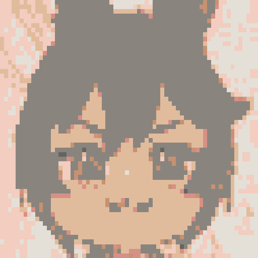

# PixelBuddy 🎨✨

A modern, high-performance, WebAssembly-first 2D pixel art & animation editor built in Rust using `eframe` / `egui`.



---

## 📂 Codebase Architecture & File Reference

Below is a detailed breakdown of what each file in the codebase does:

```
PixelBuddy/
├── Cargo.toml                  # Package manifest, dependencies (eframe 0.31 glow, egui, image, rfd, ron, serde)
├── Trunk.toml                  # WebAssembly build configuration (public_url = "./" for relative subpath hosting)
├── index.html                  # HTML entry point with canvas container and favicon metadata
├── .github/workflows/
│   └── deploy.yml              # GitHub Actions CI/CD pipeline building WASM with Trunk & deploying to Pages
├── assets/
│   ├── icon.png                # 512x512 high-resolution application icon
│   ├── favicon.png             # 64x64 browser tab icon
│   └── favicon.ico             # Standard Windows/browser ICO favicon
└── src/
    ├── main.rs                 # Main entry point (Native eframe ViewportBuilder setup & WASM WebRunner initializer)
    ├── app.rs                  # PixelBuddyApp struct (Root application state, panel composition, global hotkeys, update loop)
    │
    ├── document/               # Core Pixel Canvas & Document Data Structures
    │   ├── mod.rs              # Document struct (Multi-layer canvas, active layer tracking, flattening/compositing)
    │   ├── canvas.rs           # Canvas struct (Raw RGBA pixel buffer slice, get_pixel, set_pixel, blend_pixel)
    │   ├── layer.rs            # Layer struct (Name, opacity, visibility, locking, blend modes: Normal, Multiply, Screen, Overlay)
    │   ├── palette.rs          # Palette struct (Color swatches, selected index, color addition/removal)
    │   └── animation.rs        # AnimationManager & AnimationFrame (Multi-frame stack, FPS control, playback, onion skinning)
    │
    ├── editor/                 # Application State & Undo History Engine
    │   ├── mod.rs              # EditorState struct (Ties together Document, AnimationManager, History, Colors, ToolType, Selection)
    │   ├── history.rs          # Command pattern Undo/Redo stack (History struct, Command trait, DrawCommand)
    │   ├── selection.rs        # Selection struct (Rectangular selection bounding box mask: x0, y0, x1, y1)
    │   └── clipboard.rs        # ClipboardBuffer struct (Copying/pasting pixel rectangular regions)
    │
    ├── tools/                  # Drawing & Selection Tool Algorithms
    │   ├── mod.rs              # Tool module declarations & PixelChange type alias
    │   ├── pencil.rs           # Pixel-perfect pencil drawing with L-corner pixel correction
    │   ├── eraser.rs           # Eraser tool setting pixels to transparent [0,0,0,0]
    │   ├── line.rs             # Bresenham's line algorithm for all octants
    │   ├── shape.rs            # Midpoint rectangle and ellipse outline/filled shape drawing algorithms
    │   ├── fill.rs             # Flood fill algorithm (BFS contiguous fill & non-contiguous color replacement with channel tolerance)
    │   ├── eyedropper.rs       # Eyedropper color sampler tool
    │   ├── marquee.rs          # Marquee selection rectangle update logic
    │   └── move_tool.rs        # Pixel shifting algorithm for moving active selection or layer content
    │
    ├── ui/                     # User Interface & Visual Components
    │   ├── mod.rs              # UI module declarations
    │   ├── theme.rs            # Modern dark visual theme configuration (setup_theme)
    │   ├── canvas_view.rs      # Interactive central canvas view (Zoom/pan, pixel grid, 1:1 checkerboard alignment, selection overlay, onion skinning)
    │   ├── toolbar.rs          # Left 52px vertical tool selector panel with GPU painter vector icons
    │   ├── layers_panel.rs     # Right sidebar (Layer stack, blend modes, opacity slider, palette swatches, active color button, visual undo history)
    │   ├── menu_bar.rs         # Top menu bar (File, Edit, View, Settings) & top contextual tool options bar (Fill tolerance, shape fill)
    │   └── timeline_panel.rs   # Bottom animation timeline track (Frame thumbnails, Play/Pause, Stop, FPS slider, Onion skin toggle, frame management)
    │
    └── io/                     # File Export & Import Pipeline
        ├── mod.rs              # IoHandler & crossbeam-channel async file triggers
        ├── png.rs              # PNG encoding & decoding utilities
        ├── gif.rs              # Animated GIF exporter (image::codecs::gif)
        └── spritesheet.rs      # Horizontal grid sprite sheet PNG exporter
```

---

## ⚡ Features Overview

1. **Pixel-Perfect Canvas & Viewport**:
   - Dynamic canvas sizes (`16×16`, `32×32`, `64×64`, `128×128`).
   - Smooth pan & zoom (0.5× to 64×) with auto-fitting viewport.
   - 1:1 Pixel-aligned transparency checkerboard background & pixel grid lines.

2. **Multi-Layer System**:
   - Add, delete, duplicate, reorder layers.
   - Per-layer opacity sliders, visibility toggles, lock toggles, and blend modes (`Normal`, `Multiply`, `Screen`, `Overlay`).

3. **Drawing Tools & Vector Toolbar**:
   - Hand/Pan (`H`), Zoom (`Z`), Marquee (`M`), Move (`V`), Pencil (`B`), Eraser (`E`), Line (`L`), Rectangle (`R`), Ellipse (`O`), Fill (`G`), Eyedropper (`I`).
   - All tools drawn with monochrome GPU vector icons.
   - Top contextual options bar for tool settings (Fill tolerance, contiguous fill, shape fill).

4. **Selection & Transform**:
   - Marquee selection bounding box with 2px blue accent frame (`#6366f1`).
   - Move tool (`V`) to shift selected pixels.
   - Copy (`Ctrl+C`), Paste (`Ctrl+V`), Deselect (`Ctrl+D`).

5. **Visual Undo History Panel**:
   - Collapsible Undo History list on the right panel.
   - **1-Click Time Travel**: Click any past action in history to jump directly to that point in time.

6. **Animation & Timeline Suite**:
   - Bottom Timeline Panel with frame thumbnails (`Frame 1`, `Frame 2`...).
   - Play/Pause (`Space`), Stop, FPS slider (1–30 FPS), `+ Frame`, `Dup Frame`, `Del Frame`.
   - **Onion Skinning**: Ghost preview of previous (red) and next (blue) frames.
   - **Exporting**: Animated `.gif` export and horizontal grid sprite sheet `.png` export.

7. **Cross-Platform & WebAssembly**:
   - Native desktop executable (`cargo run`).
   - WebAssembly deployment live on GitHub Pages (`trunk build`).
